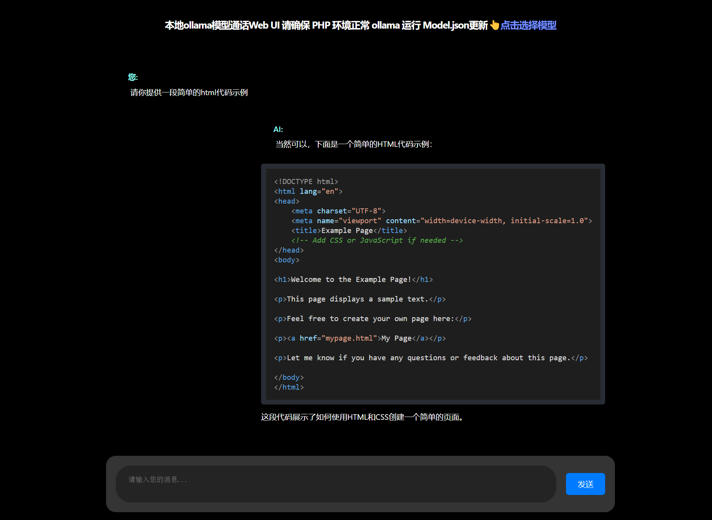
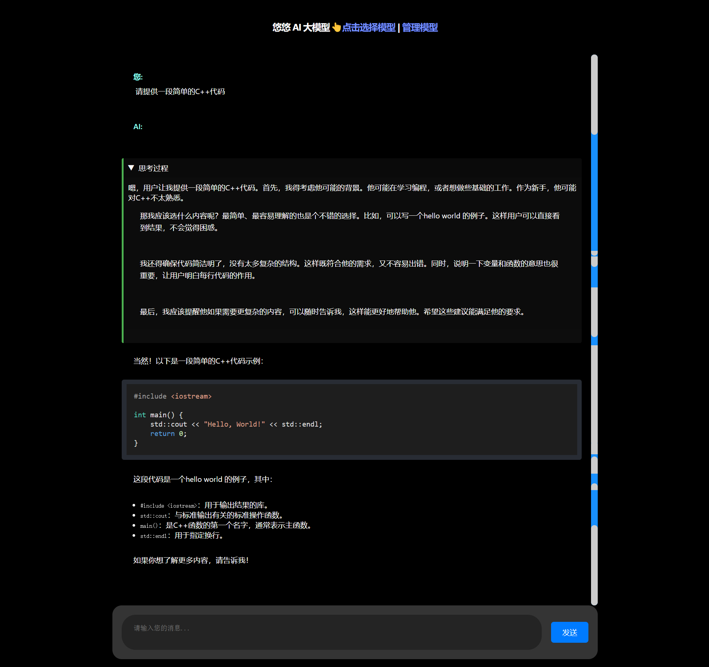
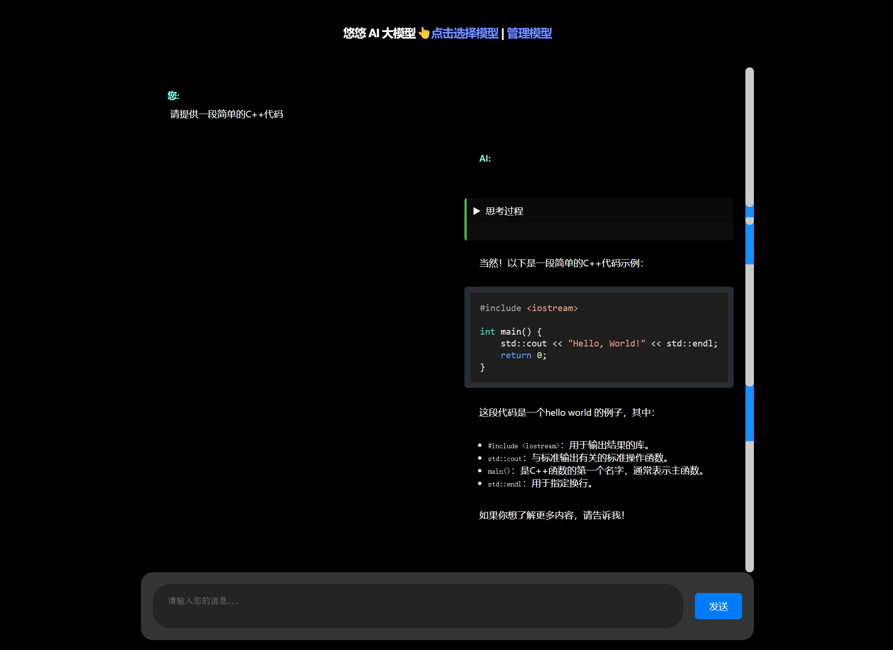
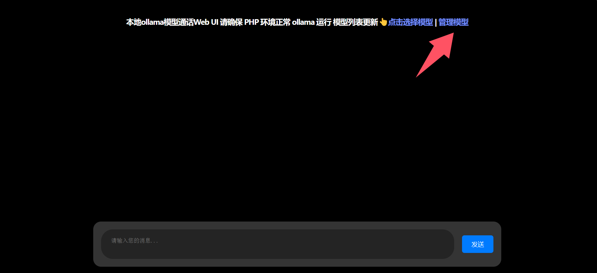
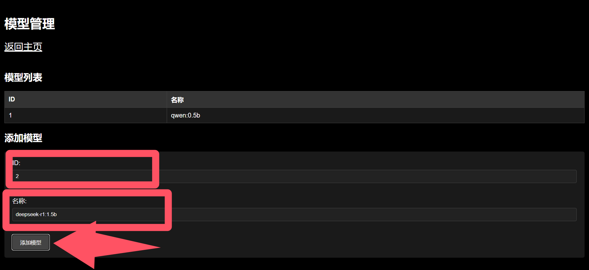
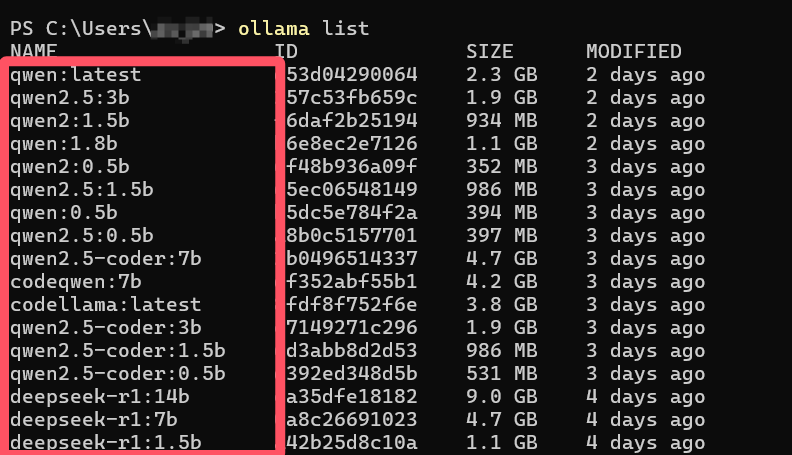
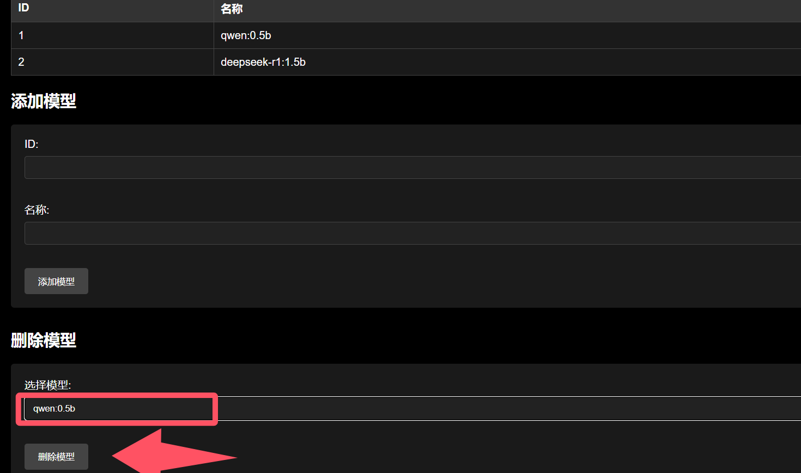

# ollama 模型 Web(网页)对话系统 (ollamaModelWebUI) php后端 持续更新!

## 宝子们看过来! 一篇纯新手详细教程 想要部署本地大模型的宝子们看过来!

## 项目简介

ollama 模型Web对话系统 (ollamaModelWebUI) 是基于php语言开发的ollama中的免费开源大模型的Web对话系统，主要用于新手使用Web与ollama中的免费开源大模型对话。

本项目和本教程都会持续更新 ，欢迎大家点点star，fork，follow，提出宝贵意见。如果有什么不满意或有BUG的地方，欢迎大家指出，我会及时修改。联系方式在后面拉~

项目UI图片:



注意 在最近新增了一个实用功能
在思考模型中的think标签的新UI样式 非常美观 可隐藏 实用~





项目UI也是非常简约高端，适合新手使用。

## ollama模型简介

ollama中的免费开源大模型是一款基于人工智能的对话系统，它可以模拟人类对话的过程，并生成符合人类语言习惯的对话。ollama中的免费开源大模型的优点是可以模拟人类对话的细节，生成符合人类语言习惯的对话，并且可以生成多种类型的对话，包括闲聊、社交、工作等。

## 本项目制作背景

ollama 模型Web对话系统 (ollamaModelWebUI) 项目的制作背景是为了方便新手使用ollama中的免费开源大模型，并能够快速上手ollama中的免费开源大模型。

## 项目特点

ollama 模型Web对话系统 (ollamaModelWebUI) 项目具有以下特点：

1. 简单易用：ollama 模型Web对话系统 (ollamaModelWebUI) 项目的界面设计简洁，操作简单，用户可以快速上手。
2. 功能丰富：ollama 模型Web对话系统 (ollamaModelWebUI) 项目提供了丰富的功能，包括闲聊、社交、工作等，用户可以根据自己的需求进行选择。
3. 安全可靠：ollama 模型Web对话系统 (ollamaModelWebUI) 项目的安全性得到了充分的保障，是本地部署的安全可靠的对话系统。
4. 免费开源：ollama 模型Web对话系统 (ollamaModelWebUI) 项目的源代码完全免费，用户可以随时查看源代码，并进行修改。

## 项目部署

ollama 模型Web对话系统 (ollamaModelWebUI) 项目的部署方式 ：本地部署：ollama 模型Web对话系统 (ollamaModelWebUI) 项目可以部署在本地服务器上，用户可以直接将项目代码上传到服务器，然后通过浏览器访问部署好的项目。

## 项目使用

ollama 模型Web对话系统 (ollamaModelWebUI) 项目的使用方式：

1. 打开ollama 官网 [https://ollama.com](https://ollama.com)

2. 点击下载  [https://ollama.com/download](https://ollama.com/download)

3. 点击 下载xxx版本 按钮，下载ollama

4. 下载完成后打开安装程序 点击install按钮 安装ollama 等待完成

5. ollama 安装完成后，ollama 自动在后台运行

6. 下载PHPstudy (PHP集成环境) [https://www.xp.cn](https://www.xp.cn)

7. 下载过后打开PHPstudy 并打开WNMP 和 开机自启 

8. 打开浏览器 输入 127.0.0.1 回车 查看是否下载成功

10. 将本项目下载到PHPstudy的www目录下 

11. 打开浏览器 输入 127.0.0.1/ollamaModelWebUI 回车 进入ollama 模型Web对话系统 (ollamaModelWebUI) 项目 查看是否进入成功

12. 再次打开ollama 进入 Model  选择你要使用的ollama模型 点击 选择参数 右侧选择复制  打开终端或命令行 粘贴 回车 等待下载完成 当出现 >>> Send a message (/? for help) 说明下载成功 可以直接输入问题 开始与ollama模型对话

13. 打开本项目主页面 点击右上角的管理模型

在管理模型的页面中输入模型ID 和 模型名称

如果不知道模型名称可以打开命令行 输入一下命令来查看模型列表
```
ollama list
```
输入后在NAME(名字)这一列添加你想添加的模型(我的建议是全添加上)

当然 也可以直接删除你不需要或没有的模型


14. 对话使用
在主页底下有一个对话框 用光标点击对话框 即可输入
输入完成后可直接按下Enter键发送
如果想换行 按住Ctrl不松再按下Enter 或者 按住Shift不松再按下Enter
稍等片刻后会输出结果 如果失败请向下查看常见问题
对话方面参考这个视频[视频](video/usephpollamaModelWebUI.mp4)

## 项目常见问题

1. 为什么ollama 使用CPU跑？
你的GPU不兼容或者没有安装CUDA。

2. ollama模型 如何换其他盘存储?
打开环境变量 新建OLLAMA_MODEL变量 值为指向你要使用的ollama模型的盘符路径 例如：D:\Models\

3. 如何使用其他ollama模型?
请参考项目部署部分的第12步。

4. 为什么在ollamaModelWebUI项目中无法使用ollama模型？
请检查你的Model.json文件是否正确 检测你的PHP环境是否安装了cURL 检测ollama日志是否有报错信息。

5. 为什么页面(或模型)未响应 或 失败
模型输出时间过长 | 最大Tokens限制 请适当调整模型参数 | 没有模型 | 没找到模型文件 | 没有找到后端(路径不要有中文和空格) | 没有PHP环境 | 文件缺失 | ollama没开启 等  可以尝试使用其他ollama模型和稍后再试

6. 会不会持续更新
会

7. ollama 下载过慢
请尝试更换网络环境 使用镜像源 或者 使用迅雷下载
在ollama 或 phpstudy 时 使用迅雷下载 (本项目自带安装包) 会更快
### ollama 下载地址
#### Windows：
```
https://ollama.com/download/OllamaSetup.exe 
```
#### Mac：
```
https://ollama.com/download/Ollama-darwin.zip 
```
#### linux：
```
curl -fsSL https://ollama.com/install.sh |sh
```


### phpstudy下载地址
#### Windows：
```
https://public.xp.cn/upgrades/phpStudy_64.zip 
```
#### linux：
##### Centos安装脚本 
```
sudo wget -O install.sh https://dl.xp.cn/dl/xp/install.sh & sudo bash install.sh
```
##### Debian安装脚本
```
sudo wget -O install.sh https://dl.xp.cn/dl/xp/install.sh & sudo bash install.sh
```
#### Mac：
```
https://public.xp.cn/upgrades/phpstudy_install.dmg
```

## 项目注意事项

1. 请不要将ollama直接部署到公网上，否则可能会被黑客攻击或没恶意使用。

2. 请不要将本项目用于违法犯罪活动，否则后果自负。

3. 本项目为开源项目 请遵循MIT协议。

## 联系方式

如果有任何问题或建议，欢迎联系我：

Q群：1030837951

邮箱：dxj20120122@outlook.com

Github：https://github.com/dxj20120122/

bilibili UID: 3546711827942289


## 后续会持续更新！！！ 请给予关注支持！！！
